# Sistema Asistente para el Cálculo del Confort Térmico de Grupos de Usuarios (ACTGU)
*******

El prototipo, de nombre <strong>“Sistema ACTGU”</strong>, es una aplicación de Inteligencia Ambiental para el Confort Térmico. Este prototipo permite configurar a grupos de usuarios y simular el cambio en la temperatura, humedad, velocidad del aire y concentración de gas en el ambiente, a lo largo del tiempo. El código fuente de este sistema se encuentra disponible en la carpeta <strong>“Prototipo/”</strong>.

 

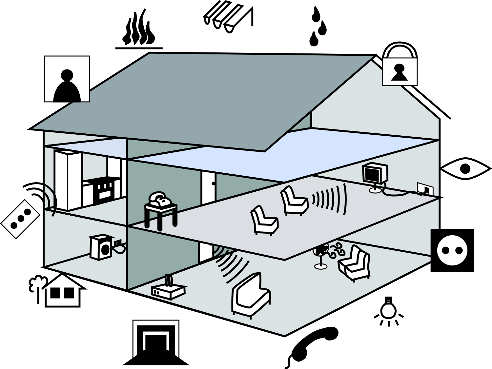

## Proyecto

El <strong>Sistema ACTGU</strong> es producto del trabajo de investigación <strong>“Estrategias para el Confort Térmico de Grupos en Aplicaciones de Inteligencia Ambiental”</strong>. Los documentos que sustentan el desarrollo de esta aplicación, son los siguientes:

 
<ul>
  <li>
<strong>Tesis/Documento.pdf:</strong> Adscribe todo el proceso de investigación, análisis, desarrollo y resultados obtenidos en este proyecto, así como el diseño y construcción del sistema presentado.
  
</li>
  <li>
<strong>Exposicion/Laminas.pdf:</strong> Resume la teoría y desarrollo que sustenta a este trabajo de investigación, y también, los resultados de evaluar al sistema presentado.
  
</li>
</ul>

 

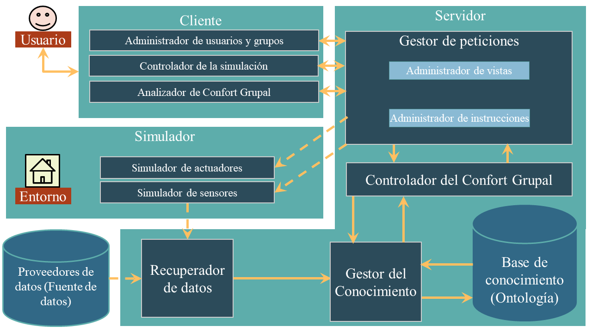

 

La arquitectura de este sistema se encuentra dividida en las tres partes suscritas por la imagen anterior: <strong>“Cliente”</strong>, <strong>“Servidor”</strong> y <strong>“Simulador”</strong>. La descripción de estos elementos y su respectiva relación con el código contenido en la carpeta <strong>“Prototipo/”</strong>, es la siguiente:

 
<ul>
  <li>
<strong>Cliente:</strong> Está formado por el proyecto Web de <strong>“Prototipo/JavaACTG/_ArchivosWeb”</strong>, y funge como el único medio de acceso por el cual, un usuario puede interactuar con el sistema.
  
</li>
  <li>
<strong>Servidor:</strong> Es formado por el proyecto <strong>“Prototipo/JavaACTG”</strong> de <strong>NeatBeans</strong>, que comprende al núcleo del sistema, encargado de organizar y almacenar la información para trabajar y calcular el Confort Térmico de un grupo en particular.
  
</li>
  <li>
<strong>Simulador:</strong> Se forma por dos proyectos, y cada uno apunta a uno de los siguientes mecanismos:
    <ul>
      <li>

      El primero adscribe al proyecto <strong>“Prototipo/JavaActuador</strong>, y funciona como receptor de las instrucciones que el sistema ordena ejecutar a los actuadores.
      
</li>
      <li>

      El segundo adscribe al proyecto <strong>“Prototipo/JavaSensor</strong>, y funciona como proveedor de datos ambientales obtenidos de dispositivos de sensado para la temperatura, humedad, velocidad del aire y concentración de gas en el espacio revisado.
      
</li>
    </ul>
  
</li>
</ul>

## Uso del Sistema ACTGU

El <strong>Sistema ACTGU</strong> presta la capacidad para administrar a usuarios y grupos, controlar la simulación y calcular el Confort Térmico de un grupo, en diferentes iteraciones a lo largo del tiempo.

 

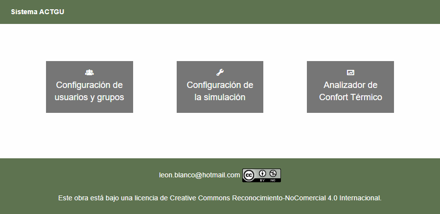

 

La imagen anterior muestra a la página principal del <strong>Cliente</strong>, que permite al usuario tomar control de todas las capacidades que él tiene con el mismo. El acceso a esta página (y a cualquiera de las otras) puede lograrse a través de la ruta <strong>http://localhost:8088</strong>, ingresada desde un navegador web. Esto último, considerando que se utiliza la configuración original de los servicios web implementados en el <strong>Servidor</strong>.

 

A fin de entender la interacción entre el usuario y sistema, a continuación se explicará el funcionamiento cada una de las páginas que forman al <strong>Cliente</strong>.

#### Configuración de grupos y usuarios

Esta página presenta dos vistas de trabajo, la primer vista tiene el objetivo administrar la información de los usuarios almacenados en la Ontología. Mientras que, la segunda vista tiene el objetivo administrar la información de los grupos.

 

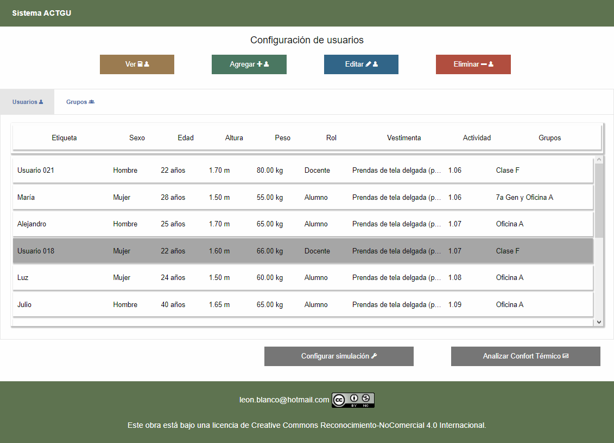

 

 

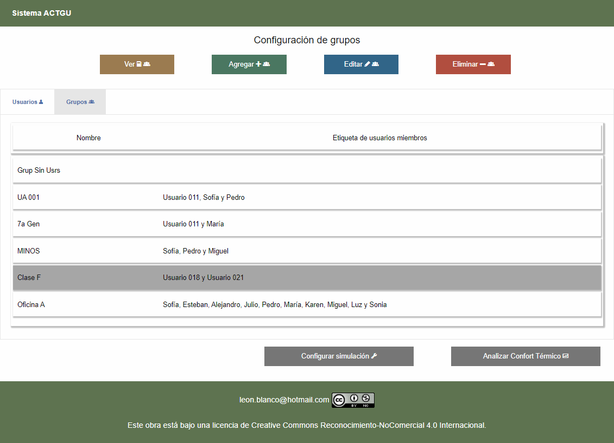

 

Al seleccionar un TAB en la página (el de <strong>Usuarios</strong> o <strong>Grupos</strong>), se mostrará una vista u otra de acuerdo a lo siguiente:

 
<ul>
  <li>
 Al seleccionar el TAB de <strong>Usuarios</strong>.
    <ul>
      <li>
 La leyenda de la parte superior de la página, escribirá el título <strong>Configuración de usuarios</strong>.
      
</li>
      <li>
 Los botones <strong>Ver</strong>, <strong>Agregar</strong>, <strong>Editar</strong> y <strong>Eliminar</strong> de la parte superior de la página, adoptaran un icono de usuario.
      
</li>
      <li>
 Se ocultará la tabla de grupos del control TAB.
      
</li>
      <li>
 Se hará visible la tabla de usuarios del control TAB y se mostrará en ella, una lista con los usuarios registrados en la Ontología, describiendo el valor de su <strong>Etiqueta</strong>, <strong>Sexo</strong>, <strong>Edad</strong>, <strong>Altura</strong>, <strong>Peso</strong>, <strong>Rol</strong>, <strong>Vestimenta</strong>, <strong>Actividad</strong> y el nombre de los <strong>Grupos</strong> a los que pertenezca.
      
</li>
    </ul>
  
</li>
  <li>
 Al seleccionar el TAB de <strong>Grupos</strong>.
    <ul>
      <li>
 La leyenda de la parte superior de la página, escribirá el título <strong>Configuración de grupos</strong>.
      
</li>
      <li>
 Los botones <strong>Ver</strong>, <strong>Agregar</strong>, <strong>Editar</strong> y <strong>Eliminar</strong> de la parte superior de la página, adoptaran un icono de grupo.
      
</li>
      <li>
 Se ocultará la tabla de usuarios del control TAB.
      
</li>
      <li>
 Se hará visible la tabla de grupos del control TAB y se mostrará en ella, una lista de los grupos registrados en la Ontología, describiendo su <strong>Nombre</strong> y la <strong>Etiqueta de usuarios miembros</strong> de cada grupo.
      
</li>
    </ul>
  
</li>
</ul>

 

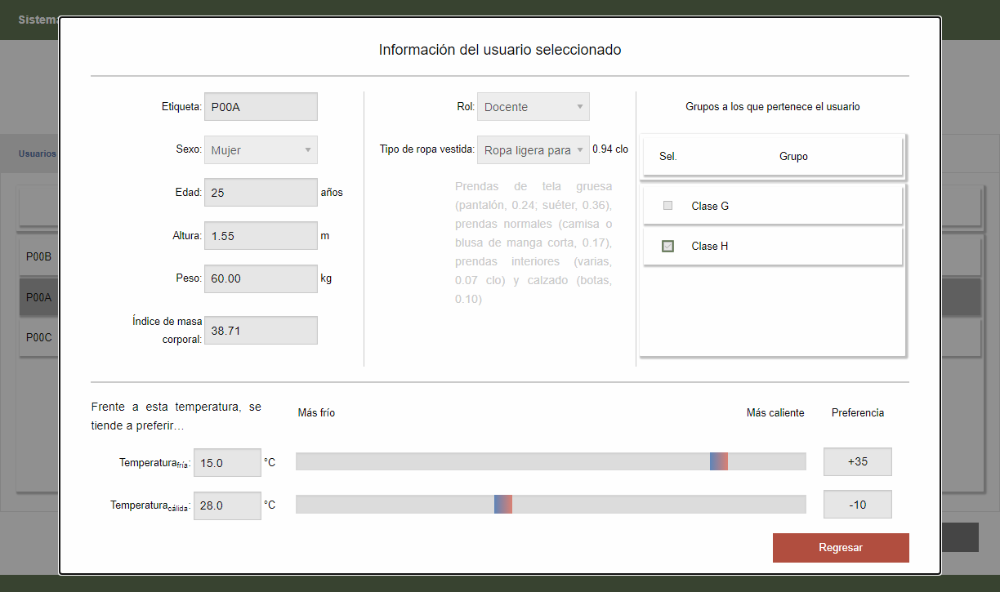

 

En la parte superior de la página se encuentran los botones <strong>Ver</strong>, <strong>Agregar</strong>, <strong>Editar</strong> y <strong>Eliminar</strong>, cuyo comportamiento depende del TAB seleccionado. De esta forma, al tener seleccionado el TAB de <strong>Usuarios</strong> y dar clic sobre el botón <strong>Ver</strong>, se desplegará la ventana expuesta para la anterior imagen, que muestra información del usuario seleccionado en la tabla de usuarios, dentro de un formulario no editable, de la siguiente manera:

 
<ul>
  <li>
 En la caja de texto <strong>Etiqueta</strong>, es escrita una etiqueta única, que distingue al usuario actual de otros.
  
</li>
  <li>
 En el selector <strong>Sexo</strong>, es seleccionado el género del usuario actual.
  
</li>
  <li>
 En la caja numérica <strong>Edad</strong>, es digitada la edad del usuario actual.
  
</li>
  <li>
 En la caja numérica <strong>Altura</strong>, es digitada la altura del usuario actual.
  
</li>
  <li>
 En la caja numérica <strong>Peso</strong>, es digitado el peso del usuario actual.
  
</li>
  <li>
 El valor digitado en la caja numérica <strong>Índice de masa corporal</strong>, es calculado en base en el valor de los controles <strong>Altura</strong> y <strong>Peso</strong>.
  
</li>
  <li>
 En el selector <strong>Rol</strong>, es seleccionado el rol del usuario actual, lo que distingue su prioridad frente a otros.
  
</li>
  <li>
 En el selector <strong>Tipo de ropa vestida</strong>, es seleccionada la vestida utilizada por el usuario actual y, con base en el valor del control <strong>Sexo</strong>, es determinado el valor CLO de la ropa seleccionada.
  
</li>
  <li>
 La tabla de grupos, ubicada en la parte derecha de esta ventana, es llenada con una serie de filas alusivas a los grupos registrados en la Ontología, cada fila con un control checkbox deshabilitado y, chequeado cuando el usuario actual pertenezca al grupo y deschequeado cuando el usuario actual no pertenezca al grupo.
  
</li>
  <li>
 En la caja numérica <strong>Temperaturap</strong>, es digitada una temperatura referente a un clima frío; en el control deslizante a su derecha, es seleccionado un valor referente a la necesidad del usuario actual, por conseguir condiciones ambientales más cálidas; y en la caja numérica de la derecha, es digitado el valor de esta necesidad.
  
</li>
  <li>
 En la caja numérica <strong>Temperaturak</strong>, es digitada una temperatura referente a un clima cálido; en el control deslizante a su derecha, es seleccionado un valor referente a la necesidad del usuario actual, por conseguir condiciones ambientales más frías; y en la caja numérica de la derecha, es digitado el valor de esta necesidad.
  
</li>
  <li>
 En la parte inferior de esta ventana, se encuentra habilitado el botón <strong>Regresar</strong>, para salir de la misma ventana.
  
</li>
</ul>

 

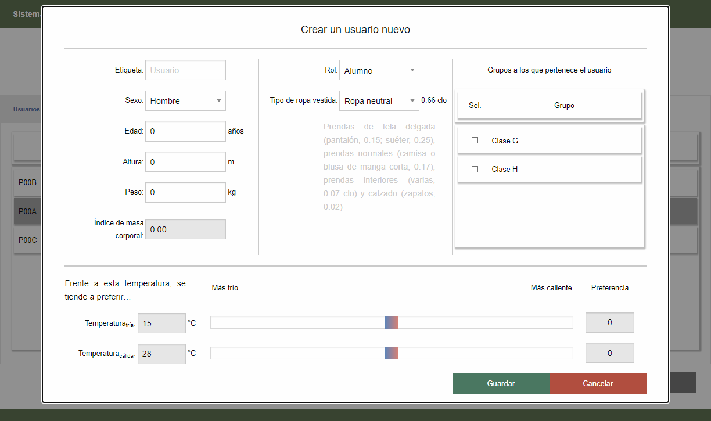

 

 

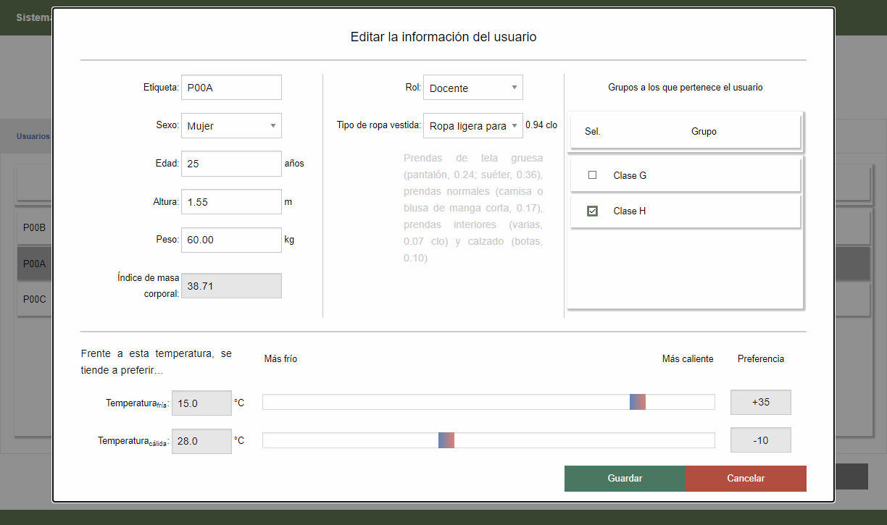

 

De forma similar, estando seleccionado el TAB de <strong>Usuarios</strong>: si se da clic en el botón <strong>Agregar</strong>, se desplegará la ventana expuesta por la imagen ante-anterior, cuyo objetivo es el registro de un usuario nuevo; o, si se da clic al botón <strong>Editar</strong>, se desplegará la ventana expuesta por la imagen anterior, cuyo objetivo es modificar la información del usuario seleccionado en la tabla de usuarios. De esta manera, la ventana desplegada por el botón <strong>Agregar</strong> o <strong>Editar</strong> suscribirá la siguiente configuración:

 
<ul>
  <li>
 El control <strong>Etiqueta</strong> estará habilitado y se espera que el valor asignado en él, no se repita con el valor de etiqueta de algún otro usuario diferente del actual.
  
</li>
  <li>
 El control <strong>Rol</strong> estará habilitado y el valor seleccionado en él, distinguirá la prioridad que el usuario actual tiene frente a otros.
  
</li>
  <li>
 El control <strong>Índice de masa corporal</strong> estará deshabilitado y su valor definido en base al valor de los controles <strong>Altura</strong> y <strong>Peso</strong> que estarán habilitados.
  
</li>
  <li>
 Los controles <strong>Sexo</strong> y <strong>Edad</strong> estarán habilitados y a la espera de valores que representen al usuario actual.
  
</li>
  <li>
 El valor CLO de la ropa del usuario actual, estará definido por el valor del control <strong>Sexo</strong> y la vestimenta seleccionada en el control <strong>Tipo de ropa vestida</strong>, que deberá estar habilitado.
  
</li>
  <li>
 Los checkbox de los grupos listados en la tabla de grupos, ubicada en el lado derecho del formulario, estarán habilitados y chequeados o deschequeados de acuerdo a la relación del usuario actual y los grupos.
  
</li>
  <li>
 Los controles <strong>Temperaturap</strong> y <strong>Temperaturak</strong> estarán deshabilitados; los controles deslizantes a su derecha habilitados; y las cajas numéricas, también ubicadas a la derecha de estos controles, deshabilitadas. Además, se espera que este asignado: un valor de temperatura en los controles <strong>Temperaturap</strong> y <strong>Temperaturak</strong>; un valor igual o superior a 50 en el control deslizante y la caja numérica, ubicados a la derecha del control <strong>Temperaturap</strong>; y un valor igual o inferior a 50 en el control deslizante y la caja numérica, ubicados a la derecha del control <strong>Temperaturak</strong>.
  
</li>
  <li>
 En la parte inferior del formulario, se mostrarán dos botones:
    <ul>
      <li>
 El botón <strong>Cancelar</strong>, para salir de esta ventana sin realizar alguna operación que afecte al usuario seleccionado o agregue a uno nuevo en el sistema.
      
</li>
      <li>
 El botón <strong>Guardar</strong>, para iniciar con el proceso de preservación de los cambios efectuados sobre los datos del usuario seleccionado o registrar a uno nuevo en la Ontología.
      
</li>
    </ul>
  
</li>
</ul>

 

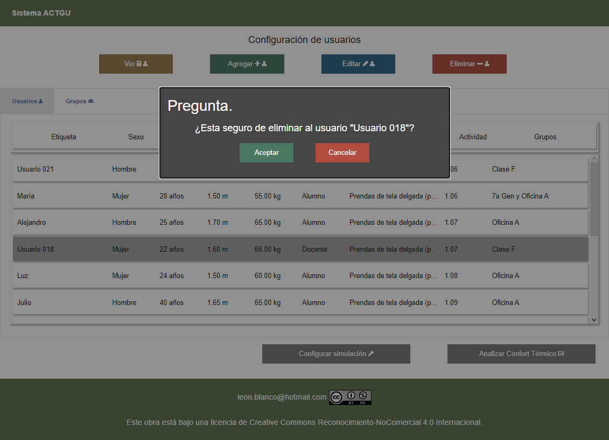

 

Si se tiene seleccionado el TAB de <strong>Usuarios</strong> y se da clic al botón <strong>Eliminar</strong>, será desplegada una ventana de confirmación como la expuesta en la imagen anterior, para autorizar eliminar al usuario seleccionado en la tabla de usuarios o cancelar dicha operación. Esto, a través de los dos botones presentados junto al mensaje:

 
<ul>
  <li>
 El botón <strong>Cancelar</strong>, para abortar el proceso de eliminación.
  
</li>
  <li>
 El botón <strong>Aceptar</strong>, para proceder con la eliminación del usuario.
  
</li>
</ul>

 

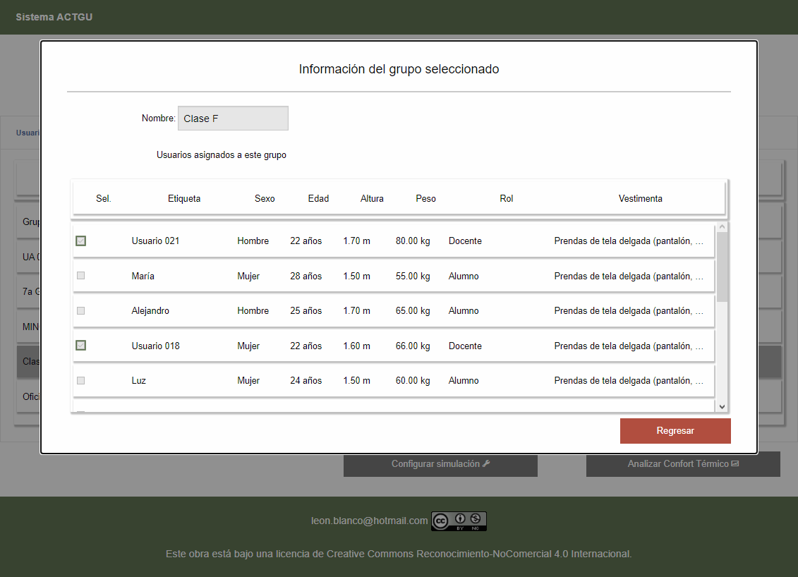

 

Por otro lado, si se tiene seleccionado el TAB de <strong>Grupos</strong> y se da clic al botón <strong>Ver</strong>, será desplegada la ventana expuesta por la imagen anterior, que muestra la información del grupo seleccionado en la tabla de grupos dentro de un formulario no editable, de la siguiente manera:

 
<ul>
  <li>
 En la caja de texto <strong>Nombre</strong>, es escrito un nombre único, que distinga al grupo actual de otros.
  
</li>
  <li>
 La tabla de usuarios, ubicada debajo del control <strong>Nombre</strong>, es llenada con una serie de filas alusivas a los usuarios registrados en el sistema, cada fila con un control checkbox deshabilitado y, chequeado cuando el usuario pertenezca al grupo actual y deschequeado cuando el usuario no pertenezca al grupo actual.
  
</li>
  <li>
 En la parte inferior de esta ventana, se encuentra habilitado el botón <strong>Regresar</strong>, para salir de la misma ventana.
  
</li>
</ul>

 

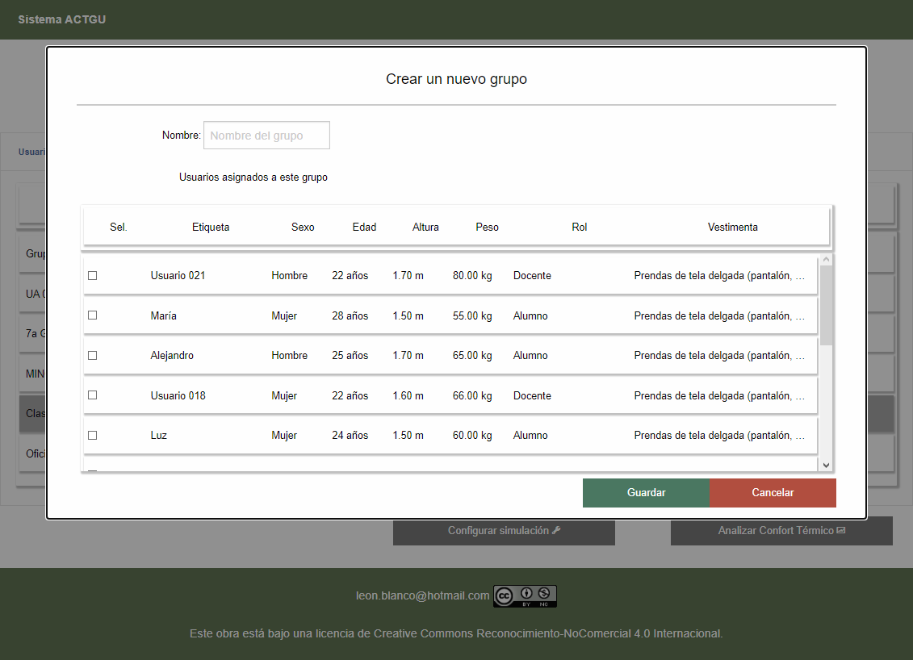

 

 

 

De la forma similar, estando seleccionado el TAB de <strong>Grupos</strong>: si se da clic en el botón <strong>Agregar</strong>, se desplegará la ventana expuesta por la imagen ante-anterior, cuyo objetivo es registrar a un grupo nuevo; o, si se da clic al botón <strong>Editar</strong>, se desplegará la ventana expuesta por la imagen anterior, cuyo objetivo es modificar la información del grupo seleccionado en la tabla de grupos. De esta manera, la ventana desplegada por el botón <strong>Agregar</strong> o <strong>Editar</strong>, suscribirá la siguiente configuración:

 
<ul>
  <li>
 El control <strong>Nombre</strong> estará habilitado y se espera que el valor asignado en él, no se repita con el nombre de algún otro grupo deferente al grupo actual.
  
</li>
  <li>
 Los checkbox de los usuarios listados en la tabla de usuarios, ubicada debajo del control <strong>Nombre</strong>, estarán habilitados y chequeados o deschequeados de acuerdo a la relación los usuarios y el grupo actual.
  
</li>
  <li>
 En la parte inferior del formulario, se mostrarán dos botones:
    <ul>
      <li>
 El botón <strong>Cancelar</strong>, para salir de esta ventana sin realizar alguna operación que afecte al grupo seleccionado o agregue a uno nuevo en él.
      
</li>
      <li>
 El botón <strong>Guardar</strong>, para iniciar con el proceso de preservación de los cambios efectuados sobre los datos del grupo seleccionado o registrar a uno nuevo en la Ontología.
      
</li>
    </ul>
  
</li>
</ul>

 

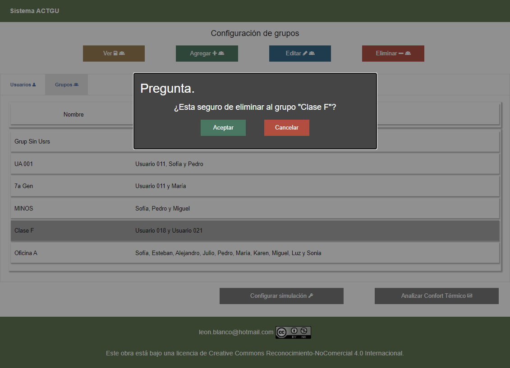

 

Si se tiene seleccionado el TAB de <strong>Grupos</strong> y se da clic al botón <strong>Eliminar</strong>, será desplegada una ventana de confirmación como la expuesta en la imagen anterior, para autorizar eliminar al grupo seleccionado en la tabla de grupos o cancelar dicha operación. Esto, a través de los dos botones presentados junto al mensaje:

 
<ul>
  <li>
 El botón <strong>Cancelar</strong>, para abortar el proceso de eliminación.
  
</li>
  <li>
 El botón <strong>Aceptar</strong>, para proceder con la eliminación del grupo.
  
</li>
</ul>

#### Configuración de la simulación

Esta página se encuentra dividida en los siguientes rubros: estrategia, pasos, condiciones ambientales, grupo y finalmente una opción de guardado. Cada uno de los controles adscritos al formulario, se encuentran organizados de la siguiente manera:

 
<ul>
  <li>
 En el apartado de estrategia se encuentran controles dirigidos a definir la forma de tratar al grupo y el modelo de confort a ser utilizado. Estos controles son:
    <ul>
      <li>
 Estrategia de Confort para grupos: Selector que indica la manera de tratar con la variabilidad del confort de un grupo de usuarios, y para lo cual, lista a las siguientes estrategias: ASHRAE 55 (Tradicional), Promedio, Placer máximo, Miseria mínima, El más respetado y El más popular.
      
</li>
      <li>
 Utilizar modelo PSU: Checkbox que indica si hacer uso del modelo Tradicional Extendido (TE) o el modelo de Preferencias Subjetivas de Usuario (PSU). Ante lo que, cabe destacar que solo con la estrategia ASHRAE 55 (Tradicional) el checkbox siempre estará deschequeado y deshabilitado, y solo con las otras estrategias, este control estará habilitado para permitir escoger entre uno de los dos modelos de Confort Térmico adoptados en este trabajo.
      
</li>
    </ul>
  
</li>
  <li>
 En el apartado de pasos se encuentran controles que ayudan a definir el número de veces que el <strong>Simulador de sensores</strong> debe modificar las condiciones ambientales que sensa y el tiempo que debe esperar para realizar dichos cambios. Estos controles son:
    <ul>
      <li>
 Número de iteraciones: Caja numérica que indica al <strong>Simulador de sensores</strong>, la cantidad de veces que se deben modificar las condiciones ambientales sensadas.
      
</li>
      <li>
 Duración de la iteración: Caja numérica que indica al <strong>Simulador de sensores</strong>, los segundos que debe esperar para modificar los valores ambientales sensados.
      
</li>
    </ul>
  
</li>
  <li>
 En el apartado de condiciones ambientales se encuentran controles que especifican, desde que valores el <strong>Simulador de sensores</strong> iniciara el sensado de datos ambientales y el valor que sumara a las condiciones ambientales sensadas, para cada ciclo de este mecanismo. Estos controles se encuentran organizados en las columnas <strong>Condiciones de inicio</strong> y <strong>Incremento por iteración</strong>, y son los siguientes:
    <ul>
      <li>
 Temperatura: Conjunto de cajas numéricas que indican al <strong>Simulador de sensores</strong>, los valores de temperatura que deben ser sensados. En donde:
        <ul>
          <li>
 La caja de la columna <strong>Condiciones de inicio</strong>, establece el valor de temperatura que deberá ser mostrado como lectura inicial (valor base).
          
</li>
          <li>
 La caja de la columna <strong>Incremento por iteración</strong>, define el valor que debe sumarse a la temperatura, en cada nuevo ciclo (valor de incremento).
          
</li>
        </ul>
      
</li>
      <li>
 Humedad: Conjunto de cajas numéricas que indican al <strong>Simulador de sensores</strong>, los valores de humedad que deben ser sensados. En donde:
        <ul>
          <li>
 La caja de la columna <strong>Condiciones de inicio</strong>, establece el valor de humedad que deberá ser mostrado como lectura inicial (valor base).
          
</li>
          <li>
 La caja de la columna <strong>Incremento por iteración</strong>, define el valor que debe sumarse a la humedad, en cada nuevo ciclo (valor de incremento).
          
</li>
        </ul>
      
</li>
      <li>
 Concentración de gas: Conjunto de cajas numéricas que indican al <strong>Simulador de sensores</strong>, los valores de concentración de gas que deben ser sensados. En donde:
        <ul>
          <li>
 La caja de la columna <strong>Condiciones de inicio</strong>, establece el valor de concentración de gas que deberá ser mostrado como lectura inicial (valor base).
          
</li>
          <li>
 La caja de la columna <strong>Incremento por iteración</strong>, define el valor que debe sumarse a la concentración de gas, en cada nuevo ciclo (valor de incremento).
          
</li>
        </ul>
      
</li>
      <li>
 Velocidad del aire: Conjunto de cajas numéricas que indican al <strong>Simulador de sensores</strong>, los valores de velocidad del aire que deben ser sensados. En donde:
        <ul>
          <li>
 La caja de la columna <strong>Condiciones de inicio</strong>, establece el valor de velocidad del aire que deberá ser mostrado como lectura inicial (valor base).
          
</li>
          <li>
 La caja de la columna <strong>Incremento por iteración</strong>, define el valor que debe sumarse a la velocidad del aire, en cada nuevo ciclo (valor de incremento).
          
</li>
        </ul>
      
</li>
    </ul>
  
</li>
  <li>
 En el apartado de grupo se encuentra únicamente el control <strong>Grupo con el cual trabajar</strong>, el cual, es un selector que indica con qué grupo de usuarios se analizara su Confort Térmico Grupal.
  
</li>
  <li>
 Finalmente, en el formulario, se encuentra el botón <strong>Guardar</strong>, el cual, inicia con el proceso para preservar cualquier cambio realizado.
  
</li>
</ul>

 

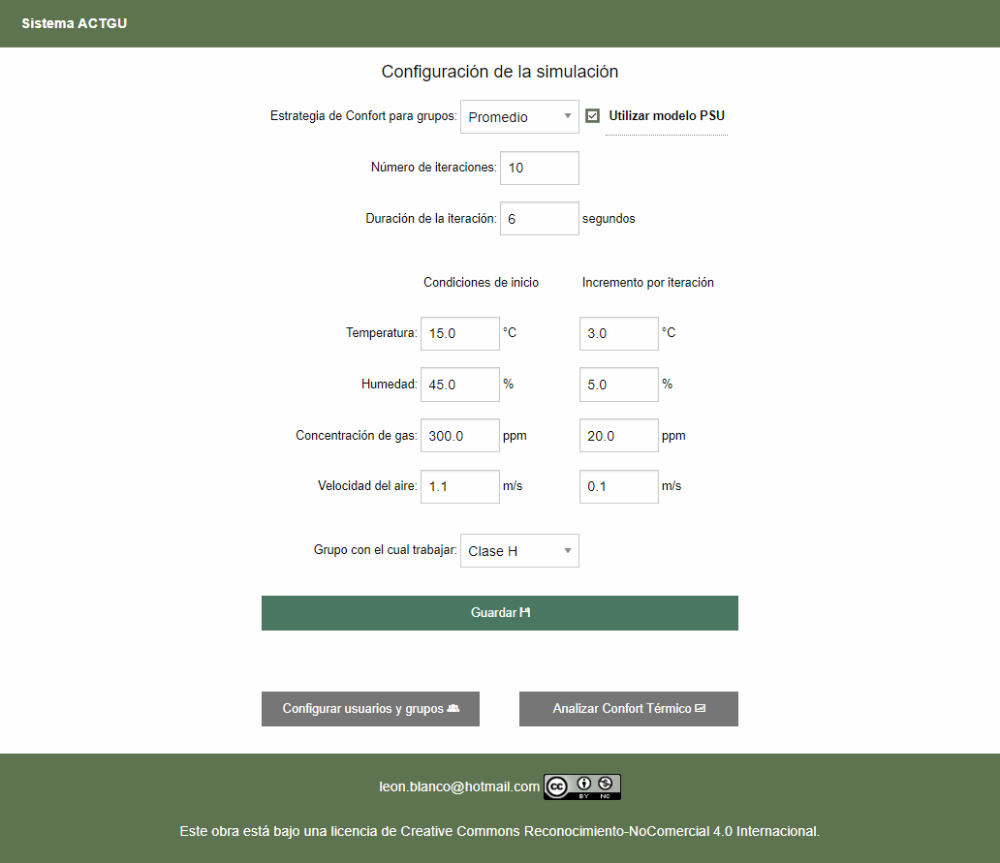

 

#### Analizador de Confort Térmcio

Esta página, presenta una serie de elementos organizados bajo las siguientes secciones:

 
<ul>
  <li>
 La sección de configuración del trabajo, comprende a los controles ubicados en la parte superior de la página. Los cuales son:
    <ul>
      <li>
 Estrategia de Confort para grupos: Selector que indica la estrategia utilizada para tratar con la variabilidad del confort del grupo revisado.
      
</li>
      <li>
 Se utiliza el modelo PSU: Checkbox que indica si se está haciendo uso del modelo Tradicional Extendido (TE) o del modelo de Preferencias Subjetivas de Usuario (PSU).
      
</li>
      <li>
 Grupo revisado: Selector que indica el nombre del conjunto de usuarios, de quienes se analiza el Confort Grupal.
      
</li>
      <li>
 Iniciar cálculo: Botón cuyo clic autoriza iniciar con los cálculos de Confort Grupal, con base en: la estrategia seleccionada, el modelo adoptado y el grupo elegido. Además, al final de este proceso la leyenda de este botón cambiara a <strong>Reiniciar cálculo</strong>.
      
</li>
    </ul>
  
</li>
  <li>
 La sección para resultados de Confort Térmico Grupal, se encuentra ubicada debajo de la sección de configuración del trabajo, y contiene una serie de controles que explican los resultados de Confort Grupal obtenidos. Estos controles son:
    <ul>
      <li>
 Confort Térmico Grupal por Iteración: Gráfica de líneas, con una serie de controles alineados a su derecha. En donde, el eje <strong>X</strong> corresponde al número de iteraciones (pruebas) ejecutadas; y el eje <strong>Y</strong> refiere al nivel de confort percibido por el grupo revisado, de acuerdo a la escala de sensación térmica ASHRAE de siete niveles. Además, los nodos de esta gráfica son elementos seleccionables, que permiten ver en los controles ubicados a la derecha del gráfico, una descripción más amplia el resultado de una determinada iteración.
      
</li>
      <li>
 Iteración: Caja numérica que apunta a la iteración del nodo seleccionado en la gráfica de Confort Térmico Grupal.
      
</li>
      <li>
 Estado: Caja de texto que escribe si el grupo se encuentra <strong>cómodo</strong> o <strong>incómodo</strong>, durante una iteración especifica.
      
</li>
      <li>
 Sensación: Caja de texto que describe la sensación térmica del grupo, durante una determinada iteración.
      
</li>
      <li>
 Confort Grupal: Control deslizante que refleja el nivel de Confort Grupal, en una determinada iteración. Además, este control se en cuenta acompañado por una caja de texto que describe de forma numérica el nivel de Confort Grupal.
      
</li>
      <li>
 Ver detalle de iteración: Botón que abre una ventana emergente, en donde, es extendida la información de Confort Grupal, del nodo seleccionado en la gráfica de Confort Térmico Grupal.
      
</li>
    </ul>
  
</li>
  <li>
 La sección para resultados de Confort Térmico Personal, se encuentra ubicada debajo de la sección para resultados de Confort Térmico Grupal, y contiene una serie de controles que explican los resultados de Confort Personal obtenidos. Estos controles son:
    <ul>
      <li>
 Confort Térmico Personal por Iteración: Gráfica de líneas, con una serie de controles alineados a su derecha. En donde, el eje <strong>X</strong> corresponde al número de iteraciones (pruebas) ejecutadas; y el eje <strong>Y</strong>, al nivel de confort percibido por el grupo revisado, de acuerdo a la escala de sensación térmica ASHRAE de siete niveles. Esta gráfica despliega una linea por cada uno de los usuarios del grupo seleccionado en el control <strong>Grupo revisado</strong>. Cada una de estas líneas se dibuja con un color diferente y se hace a sus nodos un elemento seleccionable, los cuales, permiten ver en los controles ubicados a la derecha del gráfico, una descripción más amplia del resultado que obtuvo un usuario en particular, durante una determinada iteración.
      
</li>
      <li>
 Estado: Caja de texto que escribe la etiqueta del usuario a quien pertenece el nodo seleccionado en la gráfica de Confort Térmico Personal.
      
</li>
      <li>
 Iteración: Caja numérica que apunta a la iteración del nodo seleccionado en la gráfica de Confort Térmico Personal.
      
</li>
      <li>
 Estado: Caja de texto que escribe si el usuario a quien pertenece el nodo seleccionado en la gráfica de Confort Térmico Personal, se encuentra <strong>cómodo</strong> o <strong>incómodo</strong>, durante una iteración especifica.
      
</li>
      <li>
 Sensación: Caja de texto que describe la sensación térmica del usuario a quien pertenece el nodo seleccionado en la gráfica de Confort Térmico Personal, en una determinada iteración.
      
</li>
      <li>
 Confort Personal: Control deslizante que refleja el nivel de Confort Personal del usuario a quien pertenece el nodo seleccionado en la gráfica de Confort Térmico Personal, durante una determinada iteración.
      
</li>
    </ul>
  
</li>
</ul>

 

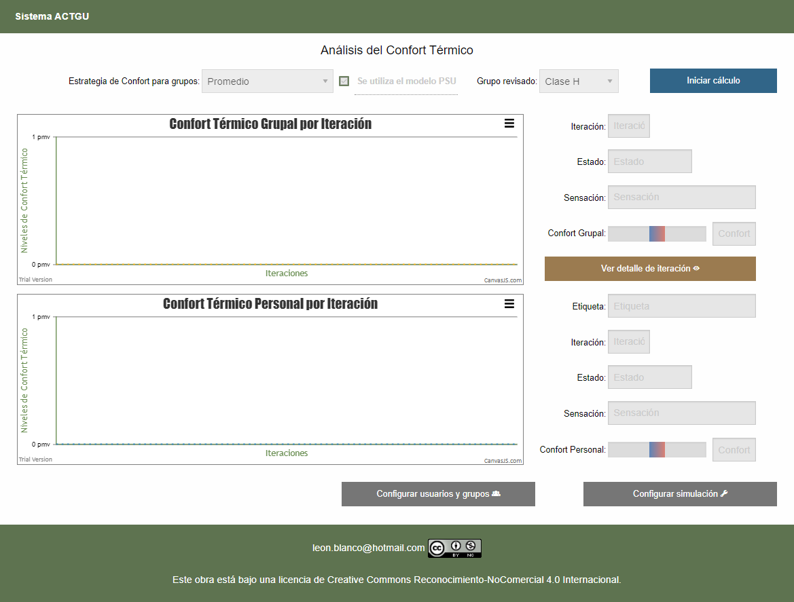

 

La configuración de la página a ser mostrada dependerá del estado de las iteraciones. Esto, de acuerdo a lo siguiente:

 
<ul>
  <li>
 Si el proceso de pruebas (las iteraciones) aún no ha iniciado: las gráficas de la página no presentaran líneas o nodos en ellas, y el botón de la esquina superior derecha tendrá la leyenda <strong>Iniciar cálculo</strong>.
  
</li>
  <li>
 Si el proceso de pruebas (las iteraciones) se encuentran en curso o ya ha concluido: las gráficas de la página presentaran una serie de líneas y nodos correspondientes a los resultados de obtenidos, y el botón de la esquina superior derecha expondrá la leyenda <strong>Reiniciar cálculo</strong>.
  
</li>
</ul>

 

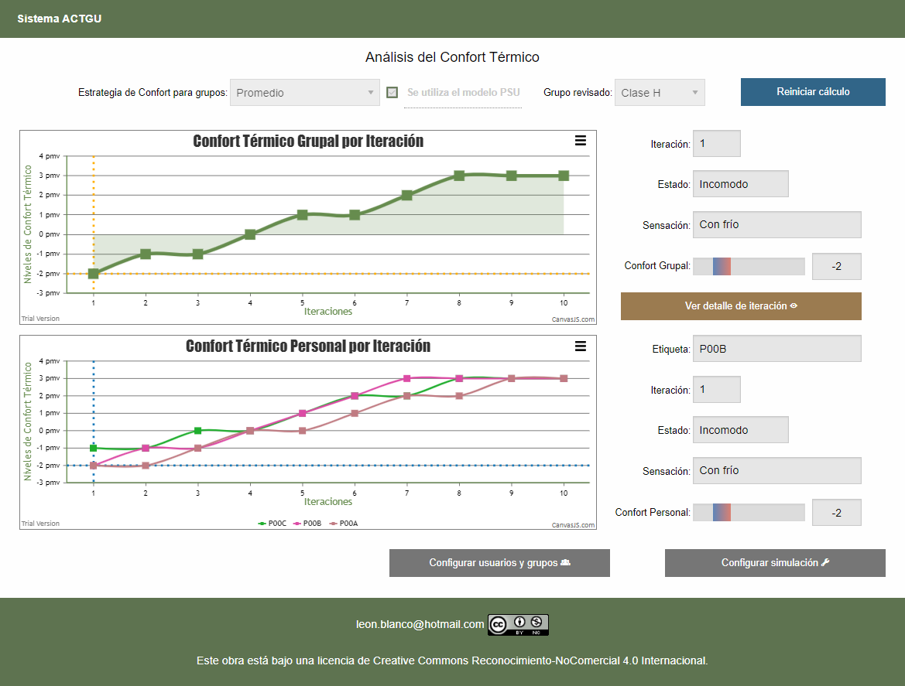

 

El botón <strong>Ver detalle de iteración</strong> de la sección de Confort Térmico Grupal, es un mecanismo que solo puede ser utilizado si hay un nodo seleccionado en la gráfica <strong>Confort Térmico Grupal por Iteraciones</strong>. La acción ejecutada por este botón despliega una ventana emergente que complementa la información de Confort Grupal del nodo seleccionado en la gráfica <strong>Confort Térmico Grupal por Iteraciones</strong>. En esta ventana emergente describe el nivel de confort percibido por el grupo, las condiciones ambientales revisadas y, si es necesario, propone una configuración para los actuadores conocidos, que facilite conseguir un estado que satisfaga térmicamente al grupo; esto, a través de una serie de controles distribuidos de la siguiente manera:

 
<ul>
  <li>
 El control <strong>Confort Térmico Grupal</strong>, ubicado en la parte superior de la ventana emergente, corresponde a una caja de texto en donde se muestra el nivel de Confort Grupal, de acuerdo a la escala de sensación térmica ASHRAE de siete niveles. Este control está acompañado por una etiqueta que explica el nivel de Confort Grupal escrito en él.
  
</li>
  <li>
 Los controles de la columna <strong>Condiciones actuales</strong>, ubicados debajo del control <strong>Confort Térmico Grupal</strong> y alineados a la izquierda de la ventana emergente, apuntan al valor de <strong>temperatura</strong>, <strong>humedad</strong>, <strong>concentración de gas</strong> y <strong>velocidad del aire</strong>, utilizados durante el proceso de análisis del Confort Térmico Grupal.
  
</li>
  <li>
 Los controles de la columna <strong>Condiciones recomendadas</strong>, ubicados debajo del control <strong>Confort Térmico Grupal</strong> y alineados al centro de la ventana emergente, apuntan al valor de <strong>temperatura</strong>, <strong>humedad</strong>, <strong>concentración de gas</strong> y <strong>velocidad del aire</strong>, bajo los cuales, el sistema considera que el grupo podría conseguir un estado aceptable de Confort Grupal.
  
</li>
  <li>
 La tabla <strong>Configuración sugerida para actuadores</strong>, ubicada debajo del control <strong>Confort Térmico Grupal</strong> y alineada a la derecha de la ventana emergente, describe el modelo que deberían de adoptar los actuadores conocidos por el sistema, para conseguir un estado aceptable de Confort Grupal. 
  
</li>
  <li>
 Botón <strong>Regresar</strong>, ubicado en la parte inferior derecha de la ventana emergente, es el único medio para salir de dicha ventana.
  
</li>
</ul>

 

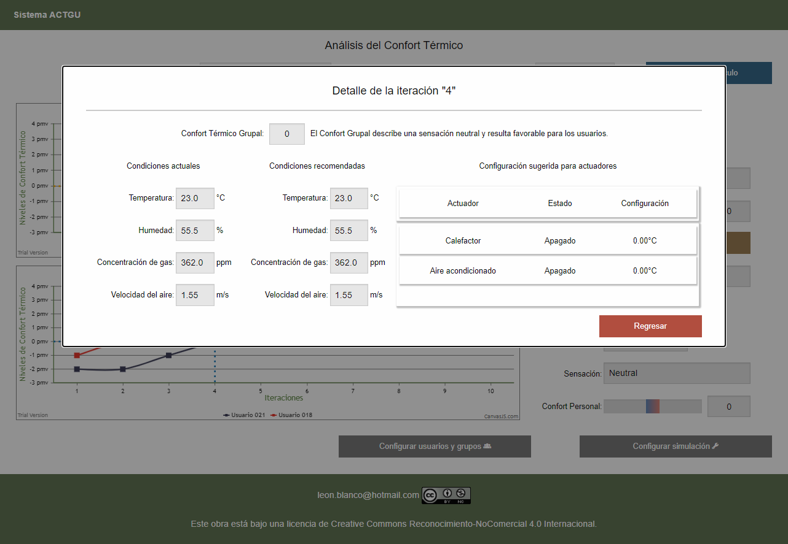

 

## Requerimientos de uso

El <strong>Sistema ACTGU</strong> es una aplicación desarrollada para navegadores web. El despliegue de cada uno de sus componentes (<strong>“Cliente”</strong>, <strong>“Servidor”</strong> y <strong>“Simulador”</strong>), requiere de lo siguiente:

||Versión|
|------|-----|
|<strong>Java</strong>|>= 8.0111|
|<strong>NetBeans</strong>|>= 8.2|

*******
## Créditos

El Sistema ACTGU fue desarrollado por < *Jorge Luis Jácome Domínguez* >.

###### Medios de contacto < [Linkedin](https://www.linkedin.com/in/jorge-luis-j%C3%A1come-dom%C3%ADnguez-44294a91/) - [Dibujando](https://dibujando.net/soragefroren) - [Facebook](https://www.facebook.com/SoraGefroren) - [Youtube](https://www.youtube.com/c/SoraGefroren) >